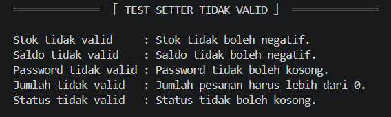

# Posttest 2 - "Sistem Penjualan dan Pemesanan Merchandise Genshin Impact pada Platform Toko Online"


═════════════════════════════════════════════════════════════════════════════════════════════


## Deskripsi Program

Program ini mensimulasikan sistem penjualan dan pemesanan merchandise Genshin Impact lewat online.

Ia menerapkan konsep OOP, seperti class, object, attribute, method, encapsulation dan property. Terdapat juga fitur untuk menyimpan data merchandise, pengguna, dan pesanan.

Program dapat melakukan beberapa proses, yaitu:

1.  Menambahkan dan menampilkan data merchandise.
2.  Menghitung diskon merchandise.
3.  Mengurangi stok merchandise setelah pembelian.
4.  Menambahkan dan menampilkan data user.
5.  Melakukan login user.
6.  Melakukan pembelian merchandise.
7.  Mengurangi saldo user setelah pembelian.
8.  Menambahkan dan menampilkan data pesanan.
9. Mengirim pesanan.
10. Menghitung total seluruh pesanan.
11. Mengubah status pesanan.
12. Menguji getter dan setter yang ada.


═════════════════════════════════════════════════════════════════════════════════════════════


## Struktur Class
Program ini memiliki tiga class utama, yaitu:


### 1. Class `merchandise`
Berfungsi untuk menyimpan data merchandise yang ada.

#### a. Class Attribute
- `totalMerchandise` = Menyimpan jumlah seluruh objek merchandise yang dibuat.

#### b. Instance Attribute
- `nama` = Menyimpan nama merchandise.
- `harga` = Menyimpan harga merchandise.
- `__stok` = Menyimpan jumlah stok merchandise secara privat (agar tidak bisa diubah sembarangan).

#### c. Method
- `__init__()` = Membuat objek merchandise dan mengisi data awal otomatis
- `tampilkanInfo()` = Menampilkan informasi objek merchandise.
- `hitungDiskon()` = Menghitung harga setelah terkena diskon.
- `property stok` = Getter, untuk mengambil nilai stok (karena stok di-privat).
- `stok.setter` = Setter, untuk mengubah stok dengan ketentuan tidak boleh negatif.

___________________________________________

### 2. Class `user`
Berfungsi untuk menyimpan data pengguna yang ada.

#### a. Class Attribute
- `totalUser` = Menyimpan jumlah seluruh objek user yang dibuat.
- `statusUser` = Menyimpan status default user.

#### b. Instance Attribute
- `username` = Menyimpan username user.
- `email` = Menyimpan email user.
- `alamat` = Menyimpan alamat user.
- `__password` = Menyimpan password user secara privat (agar tidak bisa diubah sembarangan).
- `__saldo` = Menyimpan saldo user secara privat (agar tidak bisa diubah sembarangan).

#### c. Method
- `__init__()` = Membuat objek user dan mengisi data awal otomatis.
- `login()` = Melakukan pengecekan username dan password.
- `pembelian()` = Melakukan proses pembelian merchandise.
- `property saldo` = Getter, untuk mengambil nilai saldo.
- `saldo.setter` = Setter, untuk mengubah saldo dengan ketentuan tidak boleh negatif.
- `property password` = Getter, untuk mengambil password (karena password di-privat).
- `password.setter` = Setter, untuk mengubah password dengan ketentuan tidak boleh kosong.

___________________________________________

### 3. Class `pesanan`
Berfungsi untuk menyimpan data pesanan yang dilakukan oleh user.

#### a. Class Attribute
- `statusPesanan` = Menyimpan status default awal pesanan.
- `totalPesanan` = Menyimpan jumlah seluruh objek pesanan yang dibuat.
- `daftarPesanan` = Menyimpan seluruh objek pesanan.

#### b. Instance Attribute
- `user` = Menyimpan user yang melakukan pesanan.
- `merchandise` = Menyimpan merchandise yang dipesan.
- `__jumlah` = Menyimpan jumlah merchandise yang dipesan secara privat (agar tidak bisa diubah sembarangan).
- `__status` = Menyimpan status pesanan secara privat (agar tidak bisa diubah sembarangan).

#### c. Method
- `__init__()` = Membuat objek pesanan kemudian memasukkannya ke dalam `daftarPesanan`.
- `tampilkanPesanan()` = Menampilkan informasi objek pesanan.
- `kirimPesanan()` = Mengubah status pesanan menjadi "Dikirim".
- `totalSemuaPesanan()` = Menghitung total harga dari seluruh pesanan di `daftarPesanan`.
- `property jumlah` = Getter, untuk mengambil jumlah pesanan (karena jumlah di-privat).
- `jumlah.setter` = Setter, untuk mengubah jumlah pesanan dengan ketentuan harus kebih dari nol.
- `property status` = Getter, untuk mengambil status pesanan (karena status di-privat).
- `status.setter` = Setter, untuk mengubah status pesanan dengan ketentuan tidak boleh kosong.


═════════════════════════════════════════════════════════════════════════════════════════════


## Panduan Menjalankan Program


### 1. Unduh File Program
Unduh file program yaitu "posttest1_2509106063_DindaShashaAmaranggana".

### 2. Jalankan Program
Buka VS Code lalu jalankan file tersebut.

### 3. Perhatikan Output Program
Program akan menampilkan beberapa bagian yang diujikan, yaitu:

1.  Pembuatan data merchandise
2.  Penggunaan `tampilkanInfo()`.
3.  Penggunaan `hitungDiskon()`.
4.  Pembuatan data user dan tampilkan.
5.  Penggunaan `login()`.
6.  Penggunaan `pembelian()`.
7.  Pembuatan data pesanan
8.  Penggunaan `tampilkanPesanan()`.
9.  Penggunaan `totalSemuaPesanan()`.
10. Penggunaan `kirimPesanan()`.
11. Pengujian setter jika valid atau sesuai ketentuan pada setter.
12. Pengujian setter jika tidak valid atau tidak sesuai ketentuan pada setter
13. Total merchandise, pesanan, dan user.


═════════════════════════════════════════════════════════════════════════════════════════════


## Panduan Pengujian


### 1. Pengujian Pada Class 'merchandise'
Class 'merchandise' dan isinya diuji dengan seperti:

```python
merch1 = merchandise("Flins Acrylic Stand", 150000, 10)
merch2 = merchandise("Alhaitham Keychain", 20000, 20)

print(" 『 INSTANCE METHOD (TAMPILKAN INFO) 』\n")
merch1.tampilkanInfo()
print()
merch2.tampilkanInfo()

print("\n\n 『 STATIC METHOD (HITUNG DISKON) 』\n")
hargaDiskon = merchandise.hitungDiskon(merch1.harga, 10)
print(f"Harga Flins setelah diskon 10%: Rp{hargaDiskon}")
```

Hasil dari menjalakan kode di atas adalah:


### 2. Pengujian Pada Class 'user'
Class 'user' dan isinya diuji dengan seperti:

```python
user1 = user("ayak", "12345", "dinda@gmail.com", "Samarinda", 500000)
user2 = user("shashak", "67890", "shasha@gmail.com", "Balikpapan", 300000)
print("Username Ayak :", user1.username)
print("Username Shasha :", user2.username)

print("\n\n 『 INSTANCE METHOD (LOGIN) 』\n")
print("Login Ayak :", user1.login("ayak", "12345"))
print("Login Shasha :", user2.login("shashak", "67890"))

print("\n\n 『 INSTANCE METHOD (PEMBELIAN) 』\n")
if user1.pembelian(merch1, 2):
    print("Pembelian Ayak berhasil.")
    pesan1 = pesanan(user1, merch1, 2)
    print("Saldo Ayak :", f"Rp{user1.saldo}")
    print("Stok Flins   :", merch1.stok)
else:
    print("Pembelian Ayak gagal.")
print()
if user2.pembelian(merch2, 3):
    print("Pembelian Shasha berhasil.")
    pesan2 = pesanan(user2, merch2, 3)
    print("Saldo Shasha :", f"Rp{user2.saldo}")
    print("Stok Alhaitham :", merch2.stok)
else:
    print("Pembelian Shasha gagal.")
```

Hasil dari menjalakan kode di atas adalah:


### 3. Pengujian Class 'pesanan'
Class 'pesanan' dan isinya diuji dengan seperti:

```python
print(" 『 INSTANCE METHOD (TAMPILKAN PESANAN) 』\n")
pesan1.tampilkanPesanan()
print()
pesan2.tampilkanPesanan()

print("\n\n 『 CLASS METHOD (TOTAL SEMUA PESANAN) 』\n")
print("Total seluruh pesanan :",
      f"Rp{pesanan.totalSemuaPesanan()}")

print("\n\n 『 INSTANCE METHOD (KIRIM PESANAN) 』\n")
pesan1.kirimPesanan()
print("Status Pesanan 1 :", pesan1.status)
```

Hasil dari menjalakan kode di atas adalah:


### 4. Pengujian Setter Valid
Setter diuji dengan data yang valid seperti:

```python
merch1.stok = 5
print("Stok Flins setelah diubah       :", merch1.stok)

user1.saldo = 400000
print("Saldo Ayak setelah diubah       :", f"Rp{user1.saldo}")

user1.password = "54321"
print("Password Ayak berhasil diubah.")

pesan1.jumlah = 3
print("Jumlah Pesanan 1 setelah diubah :", pesan1.jumlah)

pesan1.status = "Diproses"
print("Status Pesanan 1 setelah diubah :", pesan1.status)
```

Hasil dari menjalakan kode di atas adalah:


### 5. Pengujian Setter Tidak Valid
Setter juga diuji dengan data yang tidak valid seperti:

```python
try:
    merch1.stok = -5
except ValueError as e:
    print("Stok tidak valid     :", e)

try:
    user1.saldo = -100000
except ValueError as e:
    print("Saldo tidak valid    :", e)

try:
    user1.password = ""
except ValueError as e:
    print("Password tidak valid :", e)

try:
    pesan1.jumlah = 0
except ValueError as e:
    print("Jumlah tidak valid   :", e)

try:
    pesan1.status = ""
except ValueError as e:
    print("Status tidak valid   :", e)
```

Hasil dari menjalakan kode di atas adalah:


### 6. Pengujian Total Seluruh Data Objek
Total seluruh data objek diuji dengan seperti:

```python
print("Total Merchandise :", merchandise.totalMerchandise)
print("Total Pesanan     :", pesanan.totalPesanan)
print("Total User        :", user.totalUser)
```

Hasil dari menjalakan kode di atas adalah:


═════════════════════════════════════════════════════════════════════════════════════════════


## Kesimpulan


Program ini menerapkan konsep dasar OOP melalui tiga class, yaitu `merchandise`, `user`, dan `pesanan`.

Konsep yang diterapkan meliputi class, object, attribute, method, encapsulation dan property. Program juga menyediakan pengujian terhadap semua method dan setter menggunakan data valid maupun tidak valid.

Semua pengujian dikatakan berhasil karena hasil output sesuai yang diharapkan dan diperintahkan.