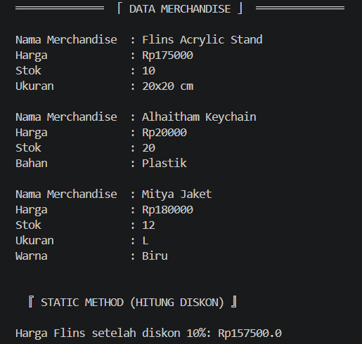
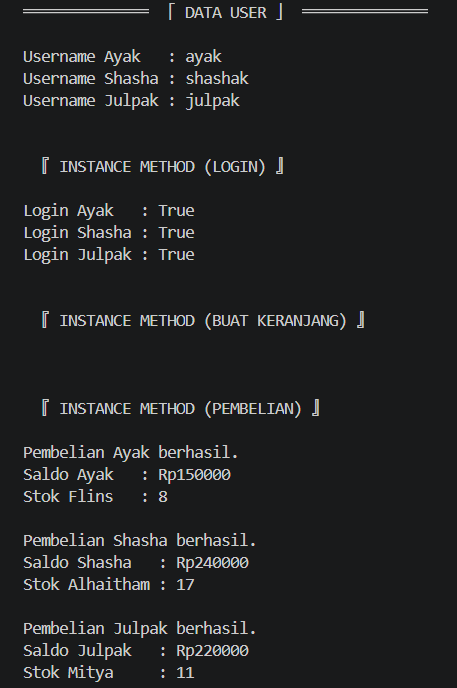
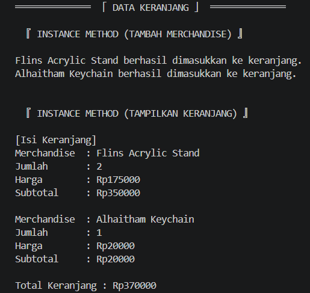
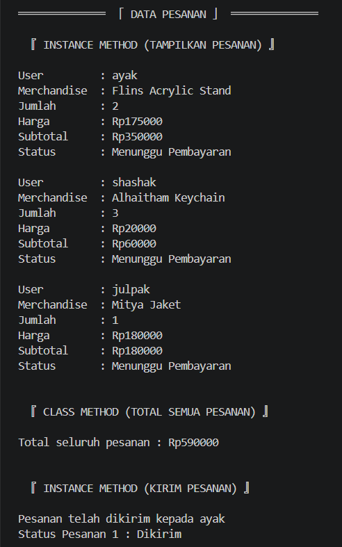
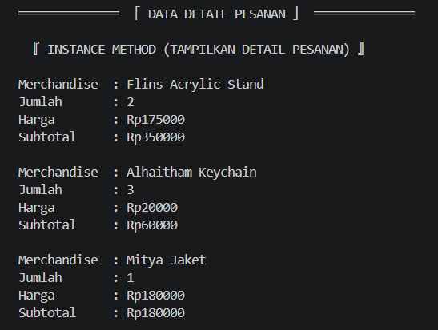
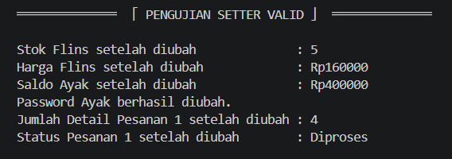
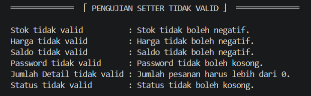
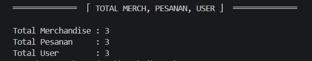

# Posttest 3 - "Sistem Penjualan dan Pemesanan Merchandise Genshin Impact pada Platform Toko Online"

════════════════════════════════════════════════════════════════════════════════════════════

## Deskripsi Program

Program ini mensimulasikan sistem penjualan dan pemesanan merchandise
Genshin Impact lewat online.

Program menerapkan konsep OOP, seperti class, object, attribute, method,
encapsulation, property, inheritance, static method, class method, serta
hubungan antar class (UML). Terdapat class untuk menyimpan data merchandise,
jaket dan acrylic stand dan keychain sebagai turunan merchandise, detail pesanan, keranjang, pesanan, dan pengguna.

Program dapat melakukan beberapa proses, yaitu:

1.  Menambahkan dan menampilkan data merchandise.
2.  Menghitung diskon merchandise.
3.  Menggunakan inheritance melalui subclass `acrylicStand`, `keychain`,
    dan `jaket`.
4.  Membuat dan menampilkan data user.
5.  Melakukan login user.
6.  Membuat keranjang milik user.
7.  Melakukan pembelian merchandise.
8.  Mengurangi saldo user setelah pembelian.
9.  Mengurangi stok merchandise setelah pembelian.
10. Menambahkan merchandise ke keranjang dan menampilkan isi keranjang.
11. Membuat pesanan dan menambahkan detail pesanan.
12. Menampilkan data pesanan.
13. Mengirim pesanan.
14. Menampilkan detail pesanan.
15. Menghitung total harga seluruh pesanan.
16. Mengubah status pesanan.
17. Menguji getter dan setter dengan data valid maupun tidak valid.
18. Menghitung jumlah seluruh objek merchandise, pesanan, dan user.


════════════════════════════════════════════════════════════════════════════════════════════


## Struktur Class
Program ini memiliki delapan class, yaitu:


### 1. Class `merchandise`
Berfungsi sebagai class dasar untuk menyimpan data umum merchandise yang ada.

#### a. Class Attribute
- `totalMerchandise` = Menyimpan jumlah seluruh objek merchandise yang dibuat, termasuk objek dari subclass.

#### b. Instance Attribute
- `nama` = Menyimpan nama merchandise.
- `_harga` = Menyimpan harga merchandise.
- `__stok` = Menyimpan jumlah stok merchandise secara privat (agar tidak bisa diubah sembarangan).

#### c. Method
- `__init__()` = Membuat objek merchandise mengisi data awal otomatis serta menambah `totalMerchandise`.
- `tampilkanInfo()` = Menampilkan informasi objek merchandise.
- `hitungDiskon()` = Static method, untuk menghitung harga setelah diskon.
- `property harga` = Getter, untuk mengambil nilai harga (karena harga di-privat).
- `harga.setter` = Setter, untuk mengubah harga dengan ketentuan tidak boleh negatif.
- `property stok` = Getter, untuk mengambil nilai stok (karena stok di-privat).
- `stok.setter` = Setter, untuk mengubah stok dengan ketentuan tidak boleh negatif.

___________________________________________

### 2. Class `acrylicStand`
Merupakan subclass dari `merchandise` yang digunakan untuk merchandise
jenis acrylic stand.

#### a. Instance Attribute
- `ukuran` = Menyimpan ukuran acrylic stand.

#### b. Method
- `__init__()` = Memanggil constructor class `merchandise` menggunakan `super()`, kemudian mengisi ukuran. Jika ukuran `"20x20 cm"`, harga ditambahkan Rp25.000.
- `tampilkanInfo()` = Menampilkan informasi sesuai class `merchandise` dan menambahkan informasi ukuran acrylic stand.

___________________________________________

### 3. Class `keychain`
Merupakan subclass dari `merchandise` yang digunakan untuk merchandise
jenis keychain.

#### a. Instance Attribute
- `bahan` = Menyimpan bahan keychain.

#### b. Method
- `__init__()` = Memanggil constructor class `merchandise` menggunakan `super()`, kemudian mengisi bahan. Jika bahan `"Boneka"`, harga ditambahkan Rp20.000.
- `tampilkanInfo()` = Menampilkan informasi sesuai class `merchandise` dan menambahkan informasi bahan keychain.

___________________________________________

### 4. Class `jaket`
Merupakan subclass dari `merchandise` yang digunakan untuk merchandise jenis jaket.

#### a. Instance Attribute
- `ukuran` = Menyimpan ukuran jaket.
- `warna` = Menyimpan warna jaket.

#### b. Method
- `__init__()` = Memanggil constructor class `merchandise` menggunakan `super()`, kemudian mengisi ukuran dan warna.
- `tampilkanInfo()` = Menampilkan informasi sesuai class `merchandise` dan menambahkan informasi ukuran serta warna jaket.

___________________________________________

### 5. Class `detailPesanan`
Berfungsi untuk menyimpan detail merchandise yang terdapat dalam suatu
pesanan.

#### a. Instance Attribute
- `merchandise` = Menyimpan objek merchandise yang dipesan.
- `__jumlah` = Menyimpan jumlah merchandise yang dipesan secara privat (agar tidak bisa diubah sembarangan).

#### b. Method
- `__init__()` = Membuat objek detail pesanan dan mengisi data awal otomatis.
- `tampilkanDetail()` = Menampilkan informasi detail pesanan.
- `property jumlah` = Getter, untuk mengambil jumlah merchandise (karena jumlah di-privat).
- `jumlah.setter` = Setter, untuk mengubah jumlah dengan ketentuan harus lebih dari nol.

___________________________________________

### 6. Class `keranjang`
Berfungsi untuk menyimpan daftar merchandise yang dimasukkan ke dalam
keranjang.

#### a. Instance Attribute
- `daftarMerch` = Menyimpan daftar merchandise dan jumlahnya di dalam keranjang.

#### b. Method
- `__init__()` = Membuat objek keranjang dan menyiapkan daftar merchandise kosong.
- `tampilkanKeranjang()` = Menampilkan informasi keranjang.
- `tambahKeranjang()` = Menambahkan merchandise ke keranjang dengan ketentuan jumlah harus lebih dari nol dan stok mencukupi.

___________________________________________

### 7. Class `pesanan`
Berfungsi untuk menyimpan data pesanan yang dilakukan oleh user serta
detail merchandise yang dipesan.

#### a. Class Attribute
- `statusPesanan` = Menyimpan status default awal pesanan.
- `totalPesanan` = Menyimpan jumlah seluruh objek pesanan yang dibuat.
- `daftarPesanan` = Menyimpan seluruh objek pesanan yang telah dibuat.

#### b. Instance Attribute
- `user` = Menyimpan user yang melakukan pesanan.
- `daftarDetail` = Menyimpan daftar objek `detailPesanan` yang terdapat dalam pesanan.
- `__status` = Menyimpan status pesanan secara privat (agar tidak bisa diubah sembarangan).

#### c. Method
- `__init__()` = Membuat objek pesanan dan mengisi data awal, menambah jumlah pesanan, memasukkan pesanan ke `daftarPesanan`, dan memasukkan pesanan ke daftar pesanan milik user.
- `tambahDetail()` = Membuat objek `detailPesanan` dan memasukkannya ke `daftarDetail`.
- `tampilkanPesanan()` = Menampilkan informasi objek pesanan.
- `kirimPesanan()` = Mengubah status pesanan menjadi "Dikirim".
- `property status` = Getter, untuk mengambil status pesanan (karena status di-privat).
- `status.setter` = Setter, untuk mengubah status dengan ketentuan tidak boleh kosong.
- `totalSemuaPesanan()` = Class method, untuk menghitung total harga dari seluruh detail pada seluruh pesanan.

___________________________________________

### 8. Class `user`
Berfungsi untuk menyimpan data pengguna dan melakukan proses yang
berkaitan dengan pembelian.

#### a. Class Attribute
- `totalUser` = Menyimpan jumlah seluruh objek user yang dibuat.
- `statusUser` = Menyimpan status default user.

#### b. Instance Attribute
- `username` = Menyimpan username user.
- `email` = Menyimpan email user.
- `alamat` = Menyimpan alamat user.
- `__password` = Menyimpan password user secara privat (agar tidak bisa diubah sembarangan).
- `__saldo` = Menyimpan saldo user secara privat (agar tidak bisa diubah sembarangan).
- `daftarPesanan` = Menyimpan daftar pesanan milik user.
- `keranjang` = Menyimpan objek keranjang milik user.

#### c. Method
- `__init__()` = Membuat objek user dan mengisi data awal serta menambah `totalUser`.
- `login()` = Melakukan pengecekan username dan password.
- `pembelian()` = Memproses pembelian jika saldo dan stok mencukupi, kemudian mengurangi saldo user dan stok merchandise.
- `buatKeranjang()` = Membuat objek keranjang untuk user jika user belum memiliki keranjang.
- `property saldo` = Getter, untuk mengambil nilai saldo (karena saldo di-privat).
- `saldo.setter` = Setter, untuk mengubah saldo dengan ketentuan tidak boleh negatif.
- `property password` = Getter, untuk mengambil password (karena password di-privat).
- `password.setter` = Setter, untuk mengubah password dengan ketentuan tidak boleh kosong.


════════════════════════════════════════════════════════════════════════════════════════════


## Diagram UML yang Tercipta


Berikut ini adalah diagram UML berdasarkan program tersebut.


════════════════════════════════════════════════════════════════════════════════════════════


## Panduan Menjalankan Program


### 1. Unduh File Program
Unduh file program yaitu "posttest2_2509106063_DindaShashaAmaranggana".

### 2. Jalankan Program
Buka VS Code lalu jalankan file tersebut.

### 3. Perhatikan Output Program
Program akan menampilkan beberapa bagian yang diujikan, yaitu:

1.  Pembuatan data merchandise.
2.  Penggunaan `tampilkanInfo()`.
3.  Penggunaan `hitungDiskon()`.
4.  Pembuatan data user dan menampilkan username.
5.  Penggunaan `login()`.
6.  Pembuatan keranjang melalui `buatKeranjang()`.
7.  Penggunaan `pembelian()`.
8.  Pembuatan data pesanan
9.  Penambahan detail ke pesanan melalui `tambahDetail()`.
10. Penambahan merchandise ke keranjang melalui `tambahKeranjang()`.
11. Penggunaan `tampilkanKeranjang()`.
12. Penggunaan `tampilkanPesanan()`.
13. Penggunaan `totalSemuaPesanan()`.
14. Penggunaan `kirimPesanan()`.
15. Pengujian setter jika valid atau sesuai ketentuan pada setter.
16. Pengujian setter jika tidak valid atau tidak sesuai ketentuan pada setter.
17. Total merchandise, pesanan, dan user.


════════════════════════════════════════════════════════════════════════════════════════════


## Panduan Pengujian


### 1. Pengujian Pada Class 'merchandise'
Class `merchandise` dan subclass-nya diuji dengan seperti:

``` python
merch1 = acrylicStand("Flins Acrylic Stand", 150000, 10, "20x20 cm")
merch2 = keychain("Alhaitham Keychain", 20000, 20, "Plastik")
merch3 = jaket("Mitya Jaket", 180000, 12, "L", "Biru")

merch1.tampilkanInfo()
print()
merch2.tampilkanInfo()
print()
merch3.tampilkanInfo()

print("\n\n 『 STATIC METHOD (HITUNG DISKON) 』\n")
hargaDiskon = merchandise.hitungDiskon(merch1.harga, 10)
print(f"Harga Flins setelah diskon 10%: Rp{hargaDiskon}")
```

Hasil dari menjalankan kode di atas adalah:




### 2. Pengujian Pada Class 'user'
Class `user` dan isinya diuji dengan seperti:

``` python
user1 = user("ayak", "12345", "aya@gmail.com", "Samarinda", 500000)
user2 = user("shashak", "67890", "shasha@gmail.com", "Balikpapan", 300000)
user3 = user("julpak", "54321", "julpak@gmail.com", "Sebulu", 400000)

print("Username Ayak   :", user1.username)
print("Username Shasha :", user2.username)
print("Username Julpak :", user3.username)

print("\n\n 『 INSTANCE METHOD (LOGIN) 』\n")
print("Login Ayak   :", user1.login("ayak", "12345"))
print("Login Shasha :", user2.login("shashak", "67890"))
print("Login Julpak :", user3.login("julpak", "54321"))

print("\n\n 『 INSTANCE METHOD (BUAT KERANJANG) 』\n")
keranjang1 = user1.buatKeranjang()
keranjang2 = user2.buatKeranjang()
keranjang3 = user3.buatKeranjang()

print("\n\n 『 INSTANCE METHOD (PEMBELIAN) 』\n")
if user1.pembelian(merch1, 2):
    print("Pembelian Ayak berhasil.")
    pesan1 = pesanan(user1)
    pesan1.tambahDetail(merch1, 2)
    print("Saldo Ayak   :", f"Rp{user1.saldo}")
    print("Stok Flins   :", merch1.stok)
else:
    print("Pembelian Ayak gagal.")
print()
if user2.pembelian(merch2, 3):
    print("Pembelian Shasha berhasil.")
    pesan2 = pesanan(user2)
    pesan2.tambahDetail(merch2, 3)
    print("Saldo Shasha   :", f"Rp{user2.saldo}")
    print("Stok Alhaitham :", merch2.stok)
else:
    print("Pembelian Shasha gagal.")
print()
if user3.pembelian(merch3, 1):
    print("Pembelian Julpak berhasil.")
    pesan3 = pesanan(user3)
    pesan3.tambahDetail(merch3, 1)
    print("Saldo Julpak   :", f"Rp{user3.saldo}")
    print("Stok Mitya     :", merch3.stok)
else:
    print("Pembelian Julpak gagal.")
```

Hasil dari menjalankan kode di atas adalah:




### 3. Pengujian Class 'keranjang'
Class `keranjang` dan isinya diuji dengan seperti:

``` python
print(" 『 INSTANCE METHOD (TAMBAH MERCHANDISE) 』\n")
if keranjang3.tambahKeranjang(merch1, 2):
    print("Flins Acrylic Stand berhasil dimasukkan ke keranjang.")
if keranjang3.tambahKeranjang(merch2, 1):
    print("Alhaitham Keychain berhasil dimasukkan ke keranjang.")

print("\n\n 『 INSTANCE METHOD (TAMBAH MERCHANDISE) 』\n")
keranjang3.tampilkanKeranjang()
```

Hasil dari menjalankan kode di atas adalah:




### 4. Pengujian Class 'pesanan'
Class `pesanan` dan isinya diuji dengan seperti:

``` python
print(" 『 INSTANCE METHOD (TAMPILKAN PESANAN) 』\n")
pesan1.tampilkanPesanan()
print()
pesan2.tampilkanPesanan()
print()
pesan3.tampilkanPesanan()

print("\n\n 『 CLASS METHOD (TOTAL SEMUA PESANAN) 』\n")
print("Total seluruh pesanan :", f"Rp{pesanan.totalSemuaPesanan()}")

print("\n\n 『 INSTANCE METHOD (KIRIM PESANAN) 』\n")
pesan1.kirimPesanan()
print("Status Pesanan 1 :", pesan1.status)
```

Hasil dari menjalankan kode di atas adalah:




### 5. Pengujian Class 'detailPesanan'
Class `detailPesanan` dan isinya diuji dengan seperti:

``` python
print(" 『 INSTANCE METHOD (TAMPILKAN DETAIL PESANAN) 』\n")
for detail in pesan1.daftarDetail:
    detail.tampilkanDetail()
print()
for detail in pesan2.daftarDetail:
    detail.tampilkanDetail()
print()
for detail in pesan3.daftarDetail:
    detail.tampilkanDetail()
```

Hasil dari menjalankan kode di atas adalah:




### 6. Pengujian Setter Valid
Setter diuji dengan data yang valid seperti:

``` python
merch1.stok = 5
print("Stok Flins setelah diubah              :", merch1.stok)

merch1.harga = 160000
print("Harga Flins setelah diubah             :", f"Rp{merch1.harga}")

user1.saldo = 400000
print("Saldo Ayak setelah diubah              :", f"Rp{user1.saldo}")

user1.password = "54321"
print("Password Ayak berhasil diubah.")

pesan1.daftarDetail[0].jumlah = 4
print("Jumlah Detail Pesanan 1 setelah diubah :", pesan1.daftarDetail[0].jumlah)

pesan1.status = "Diproses"
print("Status Pesanan 1 setelah diubah        :", pesan1.status)
```

Hasil dari menjalankan kode di atas adalah:




### 7. Pengujian Setter Tidak Valid
Setter juga diuji dengan data yang tidak valid seperti:

``` python
try:
    merch1.stok = -5
except ValueError as e:
    print("Stok tidak valid          :", e)

try:
    merch1.harga = -50000
except ValueError as e:
    print("Harga tidak valid         :", e)

try:
    user1.saldo = -100000
except ValueError as e:
    print("Saldo tidak valid         :", e)

try:
    user1.password = ""
except ValueError as e:
    print("Password tidak valid      :", e)

try:
    pesan1.daftarDetail[0].jumlah = 0
except ValueError as e:
    print("Jumlah Detail tidak valid :", e)

try:
    pesan1.status = ""
except ValueError as e:
    print("Status tidak valid        :", e)
```

Hasil dari menjalankan kode di atas adalah:




### 8. Pengujian Total Seluruh Data Objek
Total seluruh data objek diuji dengan seperti:

``` python
print("Total Merchandise :", merchandise.totalMerchandise)
print("Total Pesanan     :", pesanan.totalPesanan)
print("Total User        :", user.totalUser)
```

Hasil dari menjalankan kode di atas adalah:



════════════════════════════════════════════════════════════════════════════════════════════


## Kesimpulan


Program ini menerapkan konsep dasar OOP melalui delapan class, yaitu `merchandise`, `acrylicStand`, `keychain`, `jaket`, `detailPesanan`, `keranjang`, `pesanan`, dan `user`.

Konsep yang diterapkan meliputi class, object, attribute, method, encapsulation, property, inheritance, static method, dan class method. Program juga menyediakan pengujian terhadap method dan setter menggunakan data valid maupun tidak valid.

Semua pengujian dikatakan berhasil karena hasil output sesuai yang diharapkan dan diperintahkan.